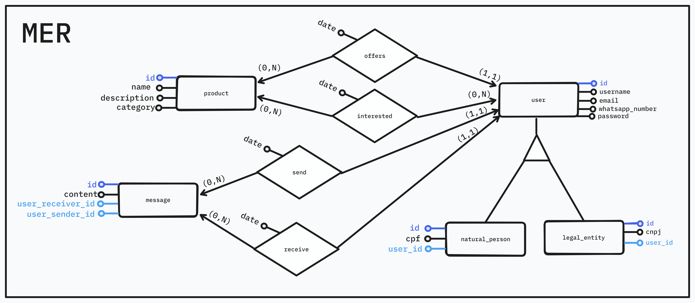

# ♻️ RRR

## 📝 O que é?

O **RRR** é uma plataforma para conectar pessoas e empresas que desejam descartar de forma adequada seus produtos indesejados.

## 🎯 Objetivos

- Reduzir descarte incorreto
- Reduzir desperdicio
- Reduzir poluição
- Auxiliar pessoas que necessitam de produtos recicláveis
- Auxiliar empresas que desejam descartar de forma adequada seus produtos indesejados

## 📝 Funcionalidades

- Um usuário pode se cadastrar
  - Pessoa Física
  - Pessoa Jurídica
- Um usuário pode se logar
- Um usuário pode se deslogar
- Um usuário pode publicar um produto que tem interesse em descartar
- Um usuário pode se interessar por um produto publicado por outro usuário
- Um usuário pode comentar um produto publicado por outro usuário
- Um usuário pode republicar um produto publicado por outro usuário, como se fosse uma indicação
- Um usuário pode conversar com outro usuário
- Um usuário pode ver o perfil de outro usuário

## 📚 Documentação

### 🎲 Banco de Dados

#### 🔷 Modelo Entidade Relacionamento

#### 🔷 Modelo Relacional

#### user

| Campo           | Tipo                     | Nulo     |
| --------------- | ------------------------ | -------- |
| id              | 🔑 Primary Key Text UUID | NOT NULL |
| name            | Text                     | NOT NULL |
| email           | Text                     | NOT NULL |
| whatsapp_number | Text                     | NOT NULL |
| password        | Text                     | NOT NULL |
